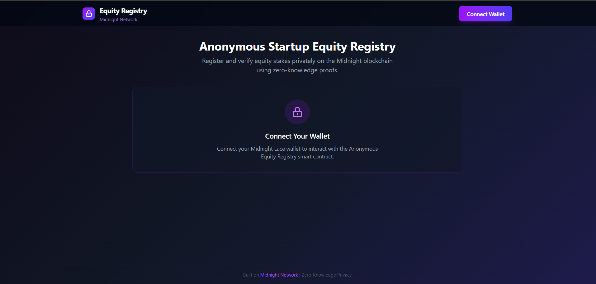
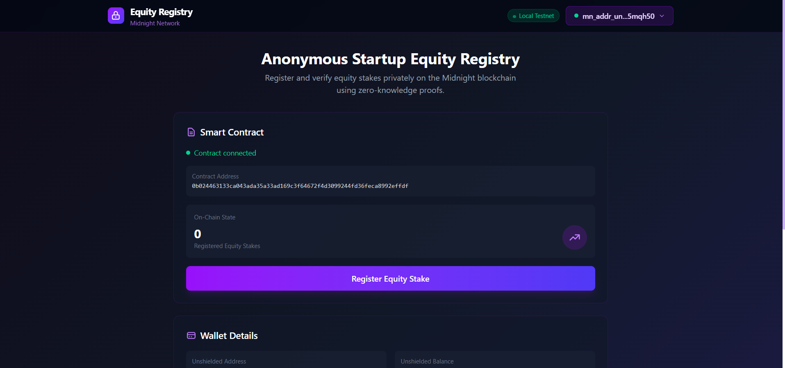

<p align="center">
  
  
  
</p>

# 🛡️ Anonymous Startup Equity Registry

> A privacy-preserving platform for managing startup equity stakes on the **Midnight Network**, where founders and investors record ownership on-chain while keeping sensitive cap table information completely confidential.

---

## 📋 Deployed Contract

| | |
|---|---|
| **Contract Address** | `0b024463133ca043ada35a33ad169c3f64672f4d3099244fd36feca8992effdf` |
| **Network** | Midnight Local Testnet (`undeployed`) |
| **Deployed At** | February 15, 2026 — 11:40 UTC |
| **Deployment Seed** | `4295e2b3cf4cd78e5c3f52f73d9f4a7e2bf419bcadd106632780fda850084e98` |

> ⚠️ **Keep the deployment seed safe** — it controls the deployer wallet and contract lifecycle.

---

## 📸 Screenshots

### Landing Page — Connect Wallet
<p align="center">
  
</p>

### Connected — Smart Contract & Wallet Details
<p align="center">
  
</p>

---

## 🎯 What It Does

Traditional cap table management exposes sensitive ownership data. This platform solves that:

| Problem | Our Solution |
|---------|-------------|
| Investors can see your full cap table | **Encrypted private state** — only authorized parties can decrypt |
| Competitors learn your fundraising details | **Zero-knowledge proofs** — verify facts without revealing data |
| Cap table records can be altered | **Immutable blockchain** — every registration is permanent |
| No audit trail for equity changes | **On-chain history** — full transaction trail on Midnight |

### Core Capabilities

- **🔐 Register Equity Stakes** — Record ownership on an immutable ledger with encrypted details
- **👁️ Privacy by Default** — Shareholder names, percentages, and vesting terms stay encrypted
- **✅ Verifiable Proofs** — Prove equity facts to auditors/regulators without exposing the cap table
- **🏦 Lace Wallet Integration** — Connect directly via Midnight's DApp Connector API

---

## 🏗️ Architecture

```
┌─────────────────────────────────────────────────────────────┐
│                    Frontend (React + Vite)                   │
│  ┌──────────────┐  ┌───────────────┐  ┌──────────────────┐  │
│  │ Wallet       │  │ Contract      │  │ Provider         │  │
│  │ Connection   │  │ Panel         │  │ Wiring           │  │
│  │ (Lace DApp   │  │ (State +      │  │ (Indexer, Proof  │  │
│  │  Connector)  │  │  Actions)     │  │  Server, Node)   │  │
│  └──────┬───────┘  └───────┬───────┘  └────────┬─────────┘  │
│         │                  │                   │             │
└─────────┼──────────────────┼───────────────────┼─────────────┘
          │                  │                   │
          ▼                  ▼                   ▼
┌─────────────────────────────────────────────────────────────┐
│                 Midnight Network (Local)                     │
│  ┌──────────────┐  ┌───────────────┐  ┌──────────────────┐  │
│  │ Node         │  │ Indexer       │  │ Proof Server     │  │
│  │ :9944        │  │ :8088         │  │ :6300            │  │
│  └──────────────┘  └───────────────┘  └──────────────────┘  │
└─────────────────────────────────────────────────────────────┘
```

### Privacy Model

| Visibility | Data |
|------------|------|
| **🟢 Public** (everyone sees) | Total stakes registered, contract address, transaction timestamps |
| **🔴 Private** (encrypted) | Shareholder identities, equity percentages, vesting schedules, valuations, share classes |

---

## 📂 Project Structure

```
Anonymous-Startup-Equity-Registry/
│
├── equity-registry-contract/          # Smart contract package
│   ├── src/
│   │   ├── counter.compact            # Compact language contract source
│   │   ├── deploy.ts                  # Deployment script
│   │   ├── index.ts                   # Package exports (Counter, createPrivateState)
│   │   └── managed/
│   │       └── counter/
│   │           ├── contract/          # Compiled JS + TypeScript types
│   │           ├── keys/              # ZK prover & verifier keys
│   │           └── zkir/              # ZK intermediate representation
│   ├── deployment.json                # Live contract address + seed
│   └── package.json
│
├── frontend-vite-react/               # React frontend
│   ├── src/
│   │   ├── midnight/
│   │   │   ├── wallet.ts              # Lace wallet via DApp Connector API v4
│   │   │   ├── providers.ts           # Midnight SDK provider wiring
│   │   │   ├── contract.ts            # ContractController (join + callTx)
│   │   │   └── types.ts              # All type definitions
│   │   ├── contexts/
│   │   │   ├── WalletContext.tsx       # Wallet state + auto-reconnect
│   │   │   └── ContractContext.tsx     # Contract lifecycle + on-chain state
│   │   ├── components/
│   │   │   ├── Header.tsx             # Navigation bar
│   │   │   ├── WalletButton.tsx       # Wallet picker / connect / disconnect
│   │   │   ├── WalletInfo.tsx         # Addresses, balances, endpoints
│   │   │   └── ContractPanel.tsx      # On-chain state + register action
│   │   ├── App.tsx                    # Root component
│   │   ├── main.tsx                   # Entry point
│   │   └── globals.ts                # Node.js polyfills for browser
│   ├── .env                           # VITE_CONTRACT_ADDRESS
│   ├── vite.config.ts                 # WASM + polyfills + TailwindCSS
│   └── package.json
│
├── midnight-local-network/            # Docker-based local network
│   ├── compose.yml                    # Node + Indexer + Proof Server
│   └── src/
│       ├── fund.ts                    # Wallet funding utilities
│       └── utils.ts                   # Network helpers
│
├── turbo.json                         # Turborepo monorepo config
├── vercel.json                        # Vercel deployment config
└── package.json                       # Workspace root
```

---

## ⚡ Quick Start

### Prerequisites

- **Node.js** 18+
- **Docker Desktop** (for local Midnight network)
- **Midnight Lace Wallet** browser extension

### 1. Start the Local Network

```bash
cd midnight-local-network
docker compose up -d
```

Wait for all 3 containers to be healthy:

| Service | Port | Purpose |
|---------|------|---------|
| Node | 9944 | Substrate blockchain node |
| Indexer | 8088 | GraphQL query service |
| Proof Server | 6300 | Zero-knowledge proof generation |

### 2. Install Dependencies

```bash
npm install
```

### 3. Build & Deploy the Contract

```bash
cd equity-registry-contract
npm run build
npm run deploy
```

This will:
1. Create a wallet from a BIP-39 mnemonic
2. Sync with the local network
3. Register for DUST token generation
4. Deploy the smart contract
5. Save the address to `deployment.json`

### 4. Start the Frontend

```bash
cd frontend-vite-react
npm run dev
```

Open **http://localhost:5173** → Connect your Lace wallet → Interact with the contract.

---

## 🔧 How It Works

### Smart Contract (Compact Language)

The contract exposes a single circuit:

```
circuit increment()         // Register an equity stake
  └─ Public:  round += 1    // Increment on-chain counter
  └─ Private: stored data   // Encrypted via Zswap shielded pool
```

| Circuit | On-Chain Effect | Private Effect |
|---------|----------------|----------------|
| `increment()` | Increments public stake counter | Stores encrypted cap table data |

### Frontend Flow

```
User clicks "Register Equity Stake"
         │
         ▼
ContractController.registerEquityStake()
         │
         ▼
ZK proof generated (Proof Server :6300)
         │
         ▼
Transaction balanced via Lace Wallet (DApp Connector API)
         │
         ▼
Transaction submitted to Midnight Node (:9944)
         │
         ▼
State update received via Indexer (:8088)
         │
         ▼
UI re-renders with new stake count
```

---

## 🛠️ Tech Stack

| Layer | Technology |
|-------|-----------|
| **Blockchain** | Midnight Network |
| **Smart Contract** | Compact Language |
| **Frontend** | React 19 + Vite 6 + TailwindCSS 4 |
| **Wallet** | Midnight Lace (DApp Connector API v4.0.0) |
| **Proof System** | Zero-Knowledge Proofs (ZK-SNARKs) |
| **State Management** | React Context + RxJS Observables |
| **Monorepo** | npm Workspaces + Turborepo |

### Key SDK Packages

```
@midnight-ntwrk/compact-js                          2.4.0   # Contract compilation
@midnight-ntwrk/compact-runtime                     0.14.0  # Contract runtime
@midnight-ntwrk/ledger-v7                           7.0.0   # Transaction types
@midnight-ntwrk/midnight-js-contracts               3.0.0   # Deploy/join contracts
@midnight-ntwrk/dapp-connector-api                  4.0.0   # Lace wallet integration
@midnight-ntwrk/wallet-sdk-facade                   1.0.0   # Wallet SDK
```

---

## 📝 Available Commands

```bash
# Root (workspace)
npm install                          # Install all packages
npm run build                        # Build everything (Turborepo)

# Contract
cd equity-registry-contract
npm run build                        # Compile TypeScript
npm run deploy                       # Deploy to local network

# Frontend
cd frontend-vite-react
npm run dev                          # Dev server → localhost:5173
npm run build                        # Production build → dist/
npm run preview                      # Preview production build
```

---

## 🌐 Network Configuration

| Service | Default URL | Env Variable |
|---------|------------|--------------|
| Indexer | `http://127.0.0.1:8088` | `INDEXER_URL` |
| Indexer WS | `ws://127.0.0.1:8088` | `INDEXER_WS_URL` |
| Node | `http://127.0.0.1:9944` | `NODE_URL` |
| Proof Server | `http://127.0.0.1:6300` | `PROOF_SERVER_URL` |
| Network ID | `undeployed` | `NETWORK_ID` |

---

## 💡 Use Cases

**Startup Equity Management** — Track founder/investor stakes without exposing cap table details to competitors.

**Fundraising Confidentiality** — Share proof of equity registration with investors without revealing the full ownership structure.

**Board Governance** — Authorized board members can verify equity records via ZK proofs.

**Regulatory Compliance** — Generate verifiable proofs of equity registration for SEC filings without full disclosure.

**M&A Due Diligence** — Prove equity facts to acquiring companies without exposing sensitive valuation data.

---

## 🚀 Roadmap

- [ ] Vesting schedule automation
- [ ] Multi-signature cap table changes
- [ ] Equity transfer between parties
- [ ] DAO governance based on equity stakes
- [ ] Oracle integration for valuation tracking
- [ ] Mainnet deployment

---

## 🤝 Contributing

1. Fork the repository
2. Create a feature branch (`git checkout -b feature/your-feature`)
3. Commit changes (`git commit -m 'Add your feature'`)
4. Push to branch (`git push origin feature/your-feature`)
5. Open a Pull Request

---

## 📄 License

Apache License 2.0 — see [LICENSE](LICENSE) for details.

---

<p align="center">
  Built with ❤️ on <strong>Midnight Network</strong> for startup founders who value privacy.
  <br/><br/>
  <a href="https://github.com/Biswajyoti005/Anonymous-Startup-Equity-Registry">GitHub</a> · 
  <a href="https://midnight.network">Midnight Network</a> · 
  <a href="https://midnight.network/docs">Documentation</a>
</p>
